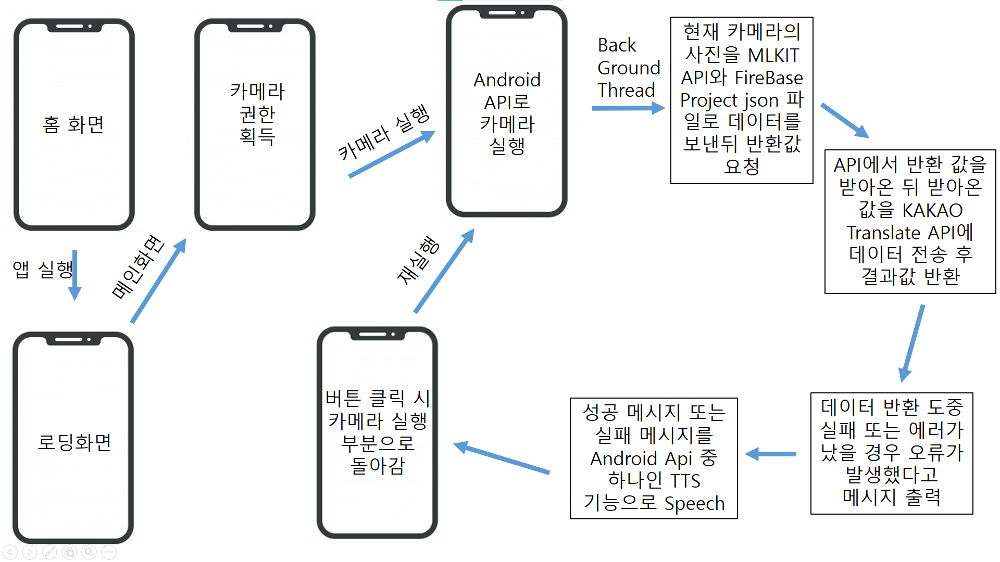
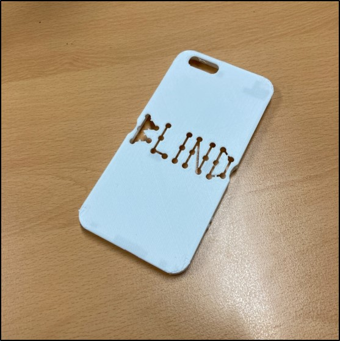
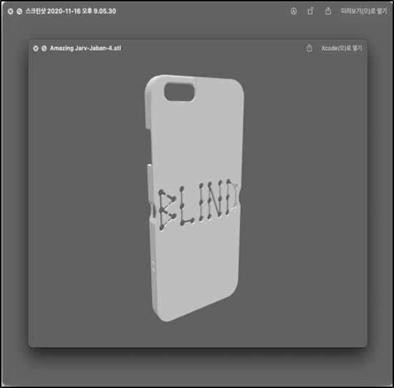
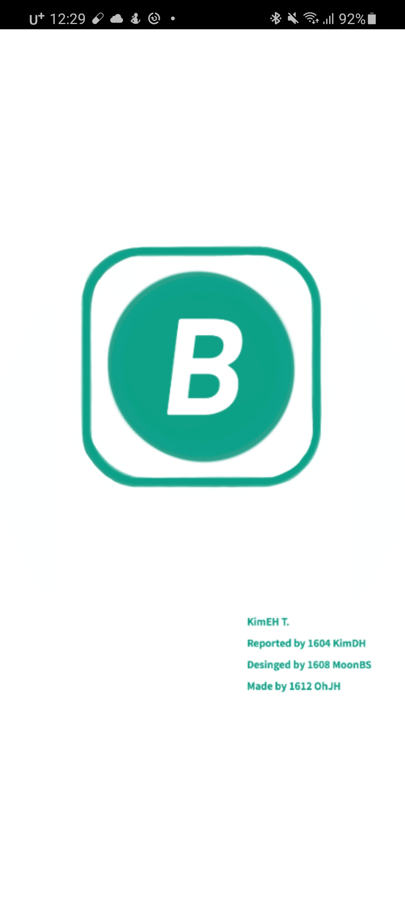
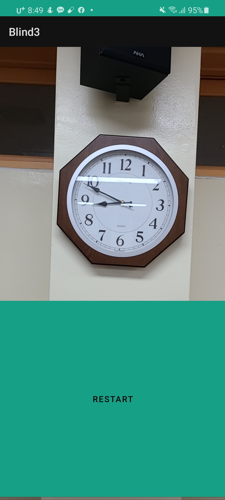

# Title
시각장애인을 위한 애플리케이션 설계

Team: Blind 연구자: 김동현, 오정현, 문병석 지도교사: 김은희

## 요약
  2020년 고등학교 연구활동으로 진행했던 "시각장애인을 위한 안드로이드 애플리케이션 설계"입니다. 

## 초록
  최근 정보화 시대를 바탕으로 음성 합성(Text-to-Speech; TTS)을 이용한 다양한 기능이 생겨났다. 이를 바탕으로 많은 이들이 편리함을 누리고 있는데, 시각장애인들은 이러한 편리함을 누리지 못하고 있는 경우가 많다. 이러한 문제점을 발견하였고 시각장애인을 위한 앱이 필요하다고 생각했다.. 시각장애인들을 위해서 여러 앱들을 분석하는 과정을 통해서 시각장애인에게 필요한 기능을 선정하고, 이에 따라서 앱을 개발하기로 하였다.

## I. 연구동기 및 목적
  음성 합성은 텍스트를 음성으로 변환하는 기술이다. 이 기술은 시각장애인 또는 저시력자를 위한 유용한 기술이다. 따라서 시각장애인들을 위한 보조공학기기가 보급되고 있고, 여러 가지 애플리케이션들이 개발되고 있다. 하지만 대부분의 앱이 버튼식 조작을 기반으로 하고 있어서 시각장애인의 편의성을 고려하지 못한 것으로 생각했다. 따라서 시각장애인의 편의성을 고려한 편리한 앱을 개발하기로 하였다. 
  따라서 휴대하기 쉬운 스마트폰에서 사용할 수 있는 시각장애인용 앱에 어떠한 기능이 필요하며, 기존의 앱에 없는 요구사항이 무엇이며, 시각장애인들이 사용할 때 불편함이 없는 UI 디자인이 무엇인지 파악하고, 여러 기술을 이용하여 시각장애인들을 위한 애플리케이션을 설계하고자 하였다.

## II. 연구 방법
1. 사전 조사 / 문헌조사 
현재 출시된 시각장애인들을 위한 앱의 종류와 사용 방법을 조사하여 보완할 점에 대해서 탐색해보았다.
2. 애플리케이션 설계를 위한 시스템 설계도 구성 
조사한 내용을 기반으로 시각장애인을 위한 애플리케이션 설계를 위한 설계도를 구성하였다.
3. 애플리케이션 개발 
안드로이드 스튜디오를 이용해서 애플리케이션 프로토타입을 제작하였다. 이 앱은 시각장애인에게 앞의 물체의 정보를 음성으로 제공해준다.
4. 애플리케이션 사용을 위한 보조장치 제작 
시각장애인을 위한 애플리케이션의 원활한 사용을 위해 보조장치를 휴대폰 케이스 형태로 만들었다. 이를 통해서 위, 아래와 왼쪽, 오른쪽 방향을 알 수 있다.

## Ⅲ. 연구 결과
  사전 조사를 통해서 보이스아이, 샤인플러스 등 여러 애플리케이션의 종류와 사용 방법을 알아봄으로써 시각장애인을 위한 앱에서 필요한 기능이 무엇인지, 어떤 점이 불편한 지에 대해서 알아본 후 애플리케이션 설계 시 필요한 점과 불필요한 점을 탐색하였다. 모든 앱이 버튼을 기반으로 하는 UI를 지니고 있어서 옆에서 대신 버튼을 눌러줄 만한 사람이 없다면 시각장애인이 스스로 할 수 있어야 한다는 취지에 맞지 않기에 적합하지 않다고 생각했다. 
  그 결과, 시각장애인들의 편의를 위해 버튼의 개수를 최소화하고, 앞의 정보를 전달해줄 기능과 위험 상황에 대비해서 보호자와 빠르게 연락이 가능한 기능이 필요하다는 결론이 나왔다.우리가 가장 중요하게 생각한 UI/UX 부분은 가장 비슷하게 만들도록 하였다. 
  앱의 주요 기능은 앞에 있는 물체에 카메라를 가져다 대면 그 물체가 무엇인지 읽어주는 것으로, 앱은 안드로이드 스튜디오를 사용하여서 제작 하였으며 Android의 API와 camera x의 API를 사용하여 카메라 기능을 사용했으며, ML KIT의 API로 사진에 있는 물체를 불러오고, 영어로 받아온 데이터 값을 카카오의 API의 번역 기능을 불러와 한국어로 사용하였다. 
 
 
  또한 이 앱을 보조하는 도구로서는 Fusion 360과 Tinkercad를 사용하여 모델링하였으며 3D프린터인 Cura를 사용해서 출력하여 케이스를 제작했다. 
 |
--- | --- | 

  앱을 실행시키면 로딩 화면 후 카메라가 실행이 된다. 시각장애인이 알고 싶은 물체의 방향으로 카메라를 가져다 대고 하단의 버튼을 누르면 앞에 무슨 물체가 있는지 음성으로 알려준다. 이는 Main Activity를 버튼 클릭 시마다 실행되게 하였다.
 |
--- | --- | 

## Ⅳ. 결론 및 고찰
  BLIND 앱을 통해서 시각장애인이 얻을 수 없는 시각 정보를 청각 정보로 바꿔서 제공할 수 있다. 이런 방법으로 애플리케이션을 사용하면 시각장애인이 스스로 할  수 있는 일을 더 늘릴 수 있는 기회를 줄 수 있을 것이다. 
  초기에는 앱의 기능을 두 가지로 만들기로 계획하였다. 첫 번째는 물체에 대한 정보를 음성으로 제공하는 기능으로, 현재 앱에 포함되어 있다. 두 번째는 버튼을 누르면 바로 보호자에게 연락을 할 수 있는 기능인데, 시각장애인이 긴급한 상황에 놓였을 때 꼭 필요한 기능이라고 생각하여 만들기로 하였으나, 스마트폰에 그러한 기능이 이미 있는 경우가 많으므로 첫 번째 기능만 구현하기로 하였다. 현재 기능이 부족하다고 생각하는데, 이후 더 많은 연구를 통해서 시각장애인에게 필요한 더 많은 기능에 대해서 고민해보고, 더 나은 앱을 개발하여 시각장애인의 삶의 질을 높일 수 있을 것이다. 
  ML KIT의 정확도가 떨어지는 것이 굉장히 아쉬웠으며, 나중에 머신러닝이나 상품검출을 잘하는 KAKAO API 등을 사용하여 정확도를 높여보고 싶다.