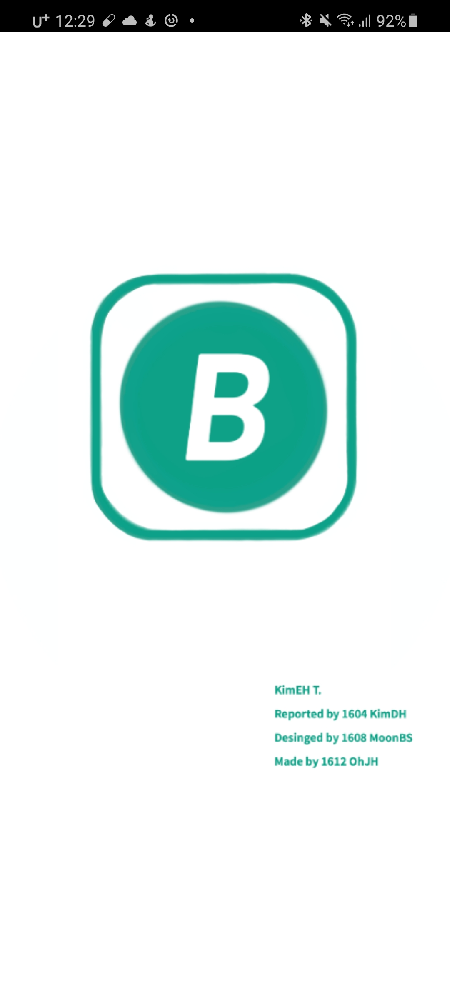
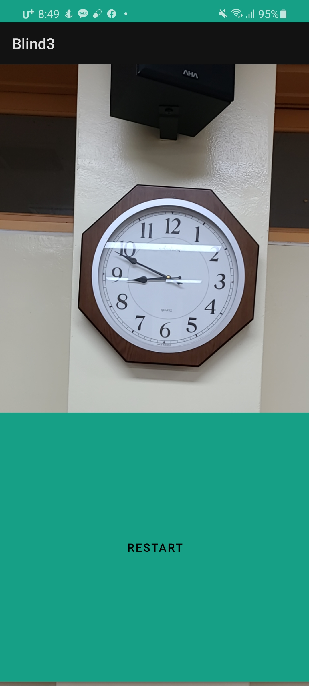

# Title
Designing applications for the visually impaired

Team: Blind students: 김동현, 오정현, 문병석 Adviser: 김은희

## Summary
This is "Designing applications for the visually impaired" which was carried out as a high school research activity in 2020.

## Abstract
Recently, based on the information age, various functions using TTS(Text-To-Speech) have been created. Based on this, many people enjoy convenience, but the visually impaired often do not enjoy this convenience. I found these problems and thought that an app for the visually impaired was needed. Through the process of analyzing various apps for the visually impaired, we selected the necessary functions for the visually impaired and decided to develop the app accordingly.

## I. Motivation and purpose of research
  Speech synthesis is a technology that converts text into speech. This technology is a useful technology for blind or low vision people. Therefore, assistive technology devices for the visually impaired are being spread, and various applications are being developed. However, I thought that most of the apps were based on button operation, so the convenience of the visually impaired was not considered. Therefore, it was decided to develop a convenient app considering the convenience of the visually impaired. 
  Therefore, what functions are needed in an app for the visually impaired that can be used on a smartphone that is easy to carry, what are the requirements that existing apps do not have, what UI design is comfortable for the visually impaired, and I tried to design an application for the visually impaired using technology.

## II. research method
1. Preliminary research / literature review 
We investigated the types of currently released apps for the visually impaired and how to use them, and explored the points to be supplemented.
2. System blueprint construction for application design 
Based on the research contents, a blueprint for application design for the visually impaired was constructed.
3. Application development 
The application prototype was created using Android Studio. This app provides information about objects in front of the visually impaired by voice.
4. Production of auxiliary devices for application use 
For the smooth use of the application for the visually impaired, the auxiliary device was made in the form of a mobile phone case. Through this, you can know the direction of up, down, left, and right.

## Ⅲ. Results
  Through a preliminary survey, by finding out the types of applications such as Voice Eye and Shine Plus and how to use them, what functions are necessary and what are inconvenient in the app for the visually impaired, and what is necessary and unnecessary when designing the application. Explored. Since all apps have a button-based UI, I thought that if there was no one next to me who could press the button instead, it would not fit the purpose that the visually impaired should be able to do it on their own. 
  As a result, it was concluded that the number of buttons was minimized for the convenience of the visually impaired, and a function to deliver the preceding information and a function to quickly contact the guardian in preparation for dangerous situations were needed. The UI we considered most important The /UX part was made to be the most similar. 
  The main function of the app is to read what the object is when you bring the camera to an object in front. The object in the picture was called with the API of ', and the data value received in English was called by the translation function of Kakao's API and used in Korean. 
 
In addition, as a tool to assist this app, Fusion 360 and Tinkercad were used for modeling, and a 3D printer, Cura, was used to output the case to produce the case. 
 |
--- | --- | 

  When you run the app, the camera runs after the loading screen. When the visually impaired person points the camera in the direction of the object they want to know and presses the button at the bottom, it tells the voice what object is in front of them. This made the Main Activity run whenever a button is clicked.
 |
--- | --- | 

## IV. Conclusion and reflection
Through the BLIND app, visual information that the blind cannot obtain can be provided by converting it into auditory information. Using applications in this way will give blind people the opportunity to increase what they can do for themselves. 
Initially, we planned to make two functions of the app. The first is the ability to provide information about objects by voice, which is now included in the app. The second is a function that allows you to contact your guardian right away by pressing a button. I decided to make it because I thought it was a necessary function when the visually impaired were in an emergency, but in many cases, smartphones already have such a function, so the first I decided to implement only the function. I think that the current function is lacking, but after further research, we will be able to think about more functions needed by the visually impaired and develop better apps to improve the quality of life of the visually impaired. 
It was very disappointing that the accuracy of ML KIT was low, and I would like to improve the accuracy later by using KAKAO API, which is good at machine learning or product detection.